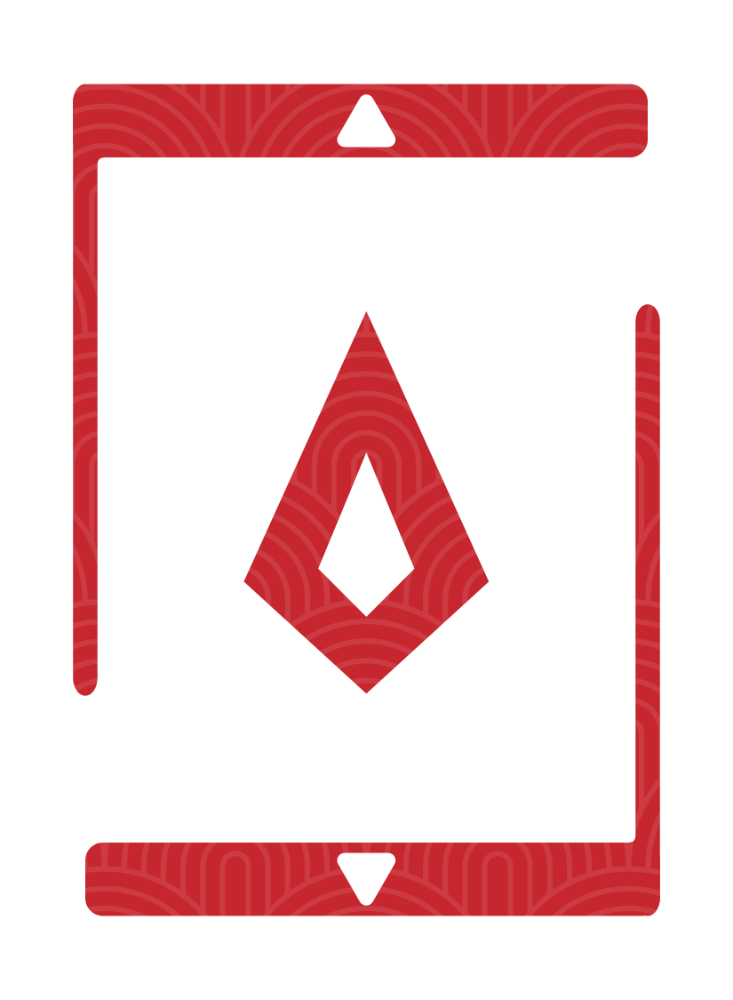
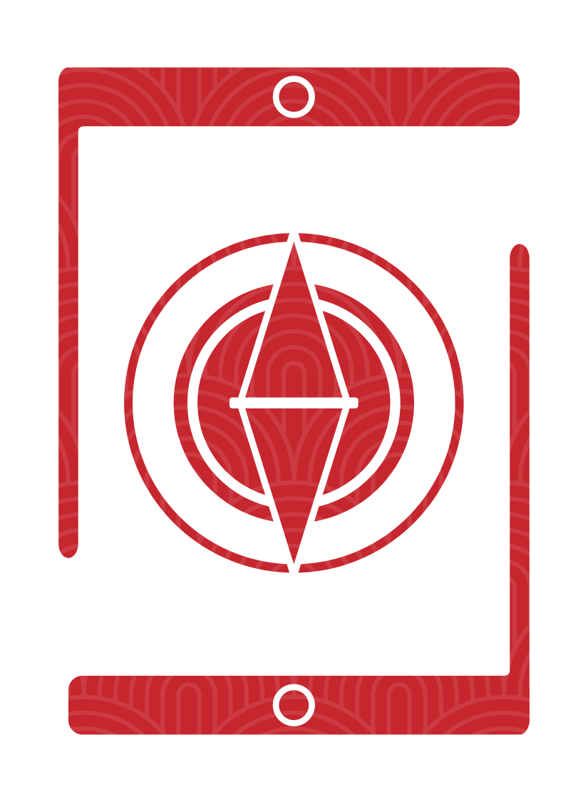
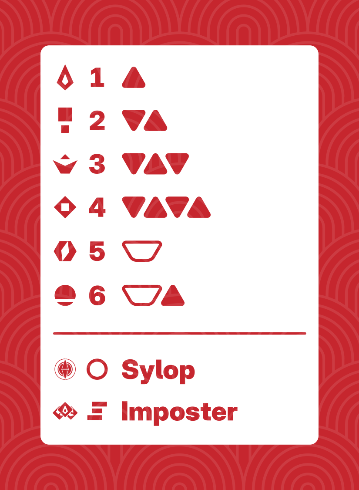
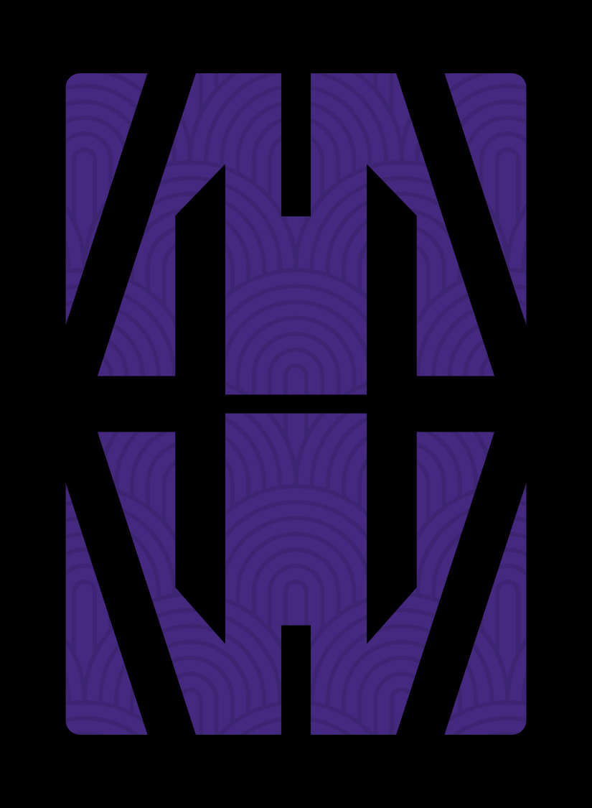
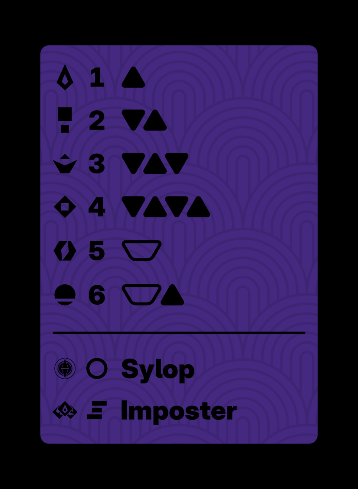

# Sabacc

Original designs and resources for a card game inspired by the Star Wars universe.

## About Sabacc

From a frontier outpost on Batuu to the spice mines of Kessel, all the way to the shipyards of Corellia and even the dazzling city-planet of Coruscant: wherever you find yourself across the galaxy, you're bound to catch folks holding cards and throwing dice at a sabacc table.

Sabacc is a card and dice centered on making the perfect hand—or at least one better than your fellow players. No matter the variant of the game, players take turns drawing and discarding in hopes of a _sabacc_ hand, or the closest hand they can get to it. Over 80 variations are known to exist, often with locally-preferred rules and even unique card decks. Widely-known versions include:

- Corellian Spike
- Kessel Sabacc
- Coruscant Shift

Cassidy’s preferred version is Kessel Sabacc: it forgoes betting rounds and simplifies hand-building to a pair of cards, making for a game that moves more quickly and is easier to pick up—yet is deceptively difficult to master. With flexibility around shift tokens (including whether or not to play with them at all) and the number of tax chips, the game offers enough variation to cater to different audiences, skill levels, and gameplay durations.

### Learn More

- [Wookieepedia](https://starwars.fandom.com/wiki/Sabacc): history and references
- [Games of the Galaxy](https://www.gamesofthegalaxy.com/sabacc-games): detailed rules and guides
- [Hyperspace Props](https://hyperspaceprops.com/sabacc/): rules, decks, dice, chips, and tokens

## Designs

Mix and match your decks for Kessel Sabacc! You want two highly-contrasting decks for the best experience.

Back | Spike | Sylop | Key
---- | ----- | ----- | ---
 |  |  | 
 |  |  | 